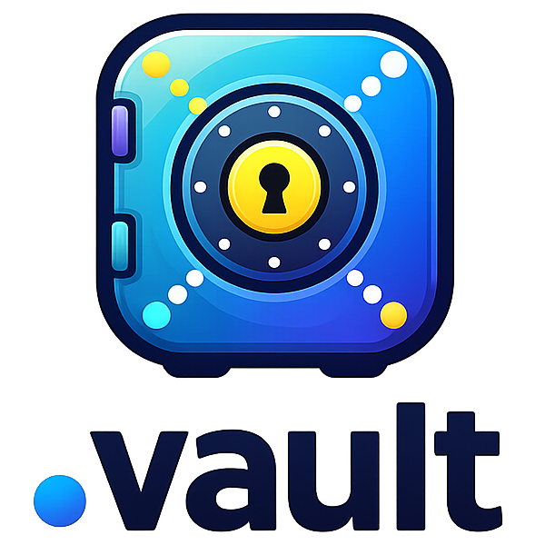

<p align="center">
  
</p>

A cross-platform daemon that runs in user context, authenticates to [HashiCorp Vault](https://www.vaultproject.io/), and performs one-way synchronisation of KVv2 secrets into local configuration files. It is intended to run as a long-lived per-user service but can also be invoked for one-off syncs.

Full documentation lives at **https://goodtune.github.io/dotvault/**.

## Why `dotvault`?

If you distribute system-level configuration to a fleet of machines — via NixOS, Ansible, Puppet, or similar — you can manage the _structure_ of dotfiles centrally. But when those files need personal secrets (API tokens, OAuth credentials, private keys), there is a gap.

**Template tools own the whole file.** `vault agent` and `consul-template` render a complete file from a template on every pass. If a user adds a genuinely useful entry to their `config.yaml`, the next render obliterates it. Baking every possible user preference into the template as an optional field is laborious and doesn't scale when you typically need to place just a handful of KV pairs — often only one — into any given file.

**`dotvault` takes a surgical approach.** Instead of owning the file, it _merges_ secret values into the coordinates where they're needed, leaving the rest of the file intact. Sysops define the rules; users remain free to customise their own dotfiles without fear of losing changes.

### Designed as a user service

`dotvault` is intended to run as a per-user service. Sysops configure desktops and remote Linux machines to launch it in a user context so that each person has their own daemon, their own Vault identity, and their own secrets.

On desktop environments it can run a local web service. If the current session is unauthenticated, `dotvault` launches a browser at its login page, triggering an OIDC authentication flow against Vault. When this is wired into an SSO provider, users are authenticated more or less transparently — no manual token juggling required.

## Features

- **Multiple auth methods** — OIDC (browser-based), LDAP with MFA (Duo push, TOTP), or token-based authentication, with automatic token renewal and re-auth on expiry
- **Seven file formats** — Write secrets as YAML, JSON, INI, TOML, netrc, or ssh_config with format-native merges that preserve existing keys not managed by `dotvault`, plus a plain-text format for full-file content such as private keys and certificates
- **Go templates** — Optionally reshape secret data before writing, with helpers like `env`, `base64encode`, `default`, and `quote`
- **Hybrid event + poll sync** — Subscribes to the Vault Events API on Enterprise for sub-second reaction to changes; falls back transparently to polling on Community Vault
- **Service enrolment** — Built-in engines acquire credentials from external services (GitHub OAuth device flow, JFrog browser login with refresh-token rotation, Ed25519 SSH keypair generation, and a Copy engine that mirrors existing KVv2 secrets into per-user paths) and persist them to Vault for distribution to every machine where `dotvault` is running
- **Web UI** — Optional loopback-only dashboard to drive login, view sync status, inspect secrets, trigger manual syncs, and download the effective config as YAML or a Windows `.reg` file
- **Windows integration** — System-tray icon for double-click launch, plus full Group Policy support via the machine policy registry (`HKLM\SOFTWARE\Policies\goodtune\dotvault`) that overrides the YAML config when present; author the policy with `reg-import`/`reg-export`
- **Dry-run mode** — Preview what would change without writing any files
- **Cross-platform** — Static, CGO-free binaries for Linux and macOS (amd64/arm64) and Windows (amd64), with platform-native file permission checks (Unix mode bits / Windows ACLs)

## Quick start

Create a config file (see [Configuration](#configuration) below) and run:

```sh
dotvault run --config path/to/config.yaml
```

Or run a single sync cycle and exit:

```sh
dotvault sync --config path/to/config.yaml
```

Check connection and sync status:

```sh
dotvault status
```

### CLI commands

| Command | Purpose |
|---------|---------|
| `dotvault run` | Run the long-lived daemon |
| `dotvault sync` | One-shot sync cycle, then exit |
| `dotvault login` | Force a fresh login via the configured auth method |
| `dotvault login-check` | Validate or renew the cached token on interactive shell login |
| `dotvault enrol` | Interactive enrolment picker (pass a name to run a single enrolment directly) |
| `dotvault browse` | Open a URL in a browser, preferring the peer over `vault.token_socket` |
| `dotvault notify` | Raise a desktop notification, preferring the peer over `vault.token_socket` |
| `dotvault status` | Display auth state, token TTL, and per-rule sync state |
| `dotvault reg-export` | Convert a Windows `.reg` file to YAML (or canonicalised `.reg`) |
| `dotvault reg-import` | Convert a YAML config to a Windows `.reg` file |
| `dotvault version` | Print build version |

Global flags: `--config <path>`, `--log-level debug|info|warn|error`, `--dry-run`.

## Configuration

`dotvault` uses a YAML config file. A minimal example:

```yaml
vault:
  address: "https://vault.example.com:8200"
  auth_method: "oidc"

sync:
  interval: "15m"

rules:
  - name: gh
    vault_key: "gh"
    target:
      path: "~/.config/gh/hosts.yml"
      format: yaml
      template: |
        github.com:
          oauth_token: "{{.oauth_token}}"
```

Default config-file locations:

- macOS: `/Library/Application Support/dotvault/config.yaml`
- Linux: `/etc/xdg/dotvault/config.yaml`
- Windows: `%ProgramData%\dotvault\config.yaml` (overridden by Group Policy when set)

### Vault

| Field | Description | Default |
|-------|-------------|---------|
| `address` | Vault server URL (required) | — |
| `auth_method` | `oidc`, `ldap`, or `token` | — |
| `kv_mount` | KVv2 mount path | `kv` |
| `user_prefix` | Prefix for per-user secret paths | `users/` |
| `ca_cert` | Path to CA certificate for TLS | — |
| `tls_skip_verify` | Skip TLS verification (dev only) | `false` |
| `disable_token_renewal` | Skip `RenewSelf` calls; expiry still triggers re-auth | `false` |

### Rules

Each rule maps a Vault secret to a local file:

| Field | Description |
|-------|-------------|
| `name` | Unique rule identifier |
| `vault_key` | Key in Vault (e.g. `gh` resolves to `kv/data/users/<you>/gh`) |
| `target.path` | Local file path (supports `~`) |
| `target.format` | One of: `yaml`, `json`, `ini`, `toml`, `text`, `netrc`, `ssh_config` |
| `target.template` | Optional Go template for formatting |

Managed files are written atomically at `0600`.

### Optional sections

**`web`** — Enable the local web dashboard (loopback-only is a hard invariant):

```yaml
web:
  enabled: true
  listen: "127.0.0.1:9000"
```

**`enrolments`** — Declare service enrolment engines so missing credentials are acquired interactively on first run and refreshed automatically thereafter. See the [service onboarding guides](https://goodtune.github.io/dotvault/services/overview/) for the supported engines.

## How it works

1. `dotvault` authenticates to Vault using the configured auth method and caches the token
2. A lifecycle manager keeps the token fresh while it is valid and re-authenticates on expiry without restarting the daemon
3. On each sync cycle (or on a Vault `kv-v2/data-write` event in Enterprise), it reads each rule's secret
4. If the secret version or file checksum has changed, it renders the data through the optional template, merges with existing file content, and writes the result atomically
5. Sync state (vault version, file checksum, timestamp) is persisted locally so unchanged secrets are skipped efficiently

## License

MIT
